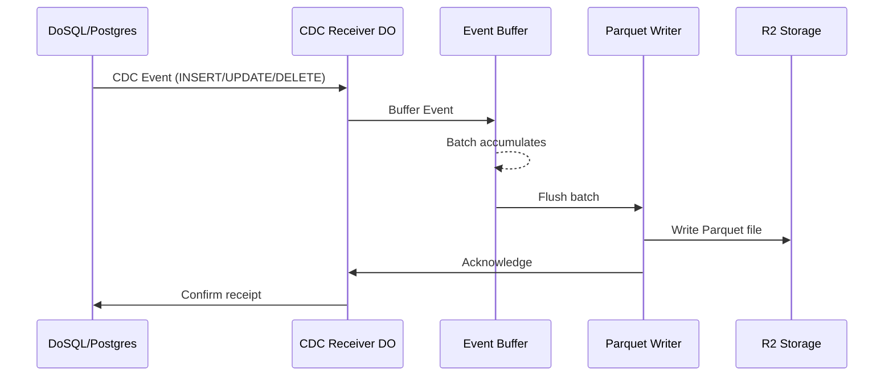
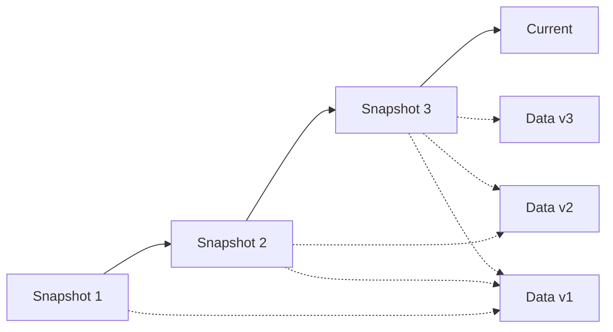
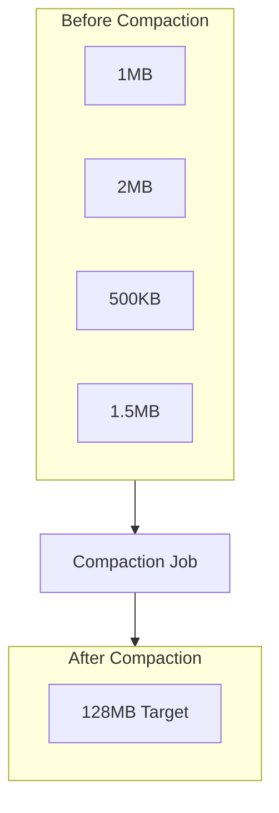

# DoLake Architecture

DoLake is a real-time Iceberg lakehouse built on Cloudflare's global edge network. This document explains how it works.

## Overview

```
┌─────────────────────────────────────────────────────────────────────┐
│                         Your Application                             │
└─────────────────────────────────────────────────────────────────────┘
                                   │
                                   ▼
┌─────────────────────────────────────────────────────────────────────┐
│                         DoLake Client                                │
│  ┌─────────────┐  ┌─────────────┐  ┌─────────────────────────────┐  │
│  │ CDC Stream  │  │  Query API  │  │  Iceberg Catalog Client     │  │
│  └─────────────┘  └─────────────┘  └─────────────────────────────┘  │
└─────────────────────────────────────────────────────────────────────┘
                                   │
                                   ▼
┌─────────────────────────────────────────────────────────────────────┐
│                    Cloudflare Edge Network                           │
│  ┌─────────────────────────────────────────────────────────────────┐│
│  │                    Durable Objects                               ││
│  │  ┌──────────────┐  ┌──────────────┐  ┌────────────────────────┐ ││
│  │  │ CDC Receiver │  │ Compaction   │  │  Snapshot Manager      │ ││
│  │  │              │  │ Coordinator  │  │                        │ ││
│  │  └──────────────┘  └──────────────┘  └────────────────────────┘ ││
│  └─────────────────────────────────────────────────────────────────┘│
│                                   │                                  │
│                                   ▼                                  │
│  ┌─────────────────────────────────────────────────────────────────┐│
│  │                         R2 Storage                              ││
│  │  ┌──────────────┐  ┌──────────────┐  ┌────────────────────────┐ ││
│  │  │ Iceberg Data │  │  Metadata    │  │  Manifest Files        │ ││
│  │  │   (Parquet)  │  │  (Avro)      │  │                        │ ││
│  │  └──────────────┘  └──────────────┘  └────────────────────────┘ ││
│  └─────────────────────────────────────────────────────────────────┘│
└─────────────────────────────────────────────────────────────────────┘
```

## Core Components

### CDC Receiver

The CDC Receiver accepts change events from source databases:



Key features:
- **Exactly-once delivery** - Events are deduplicated by LSN
- **Ordering guarantees** - Events arrive in commit order
- **Backpressure handling** - Automatic flow control

### Iceberg Table Format

DoLake stores data in Apache Iceberg format:

```
warehouse/
├── users/
│   ├── metadata/
│   │   ├── v1.metadata.json
│   │   ├── v2.metadata.json      # New snapshot
│   │   └── v3.metadata.json      # Latest
│   ├── data/
│   │   ├── part-00001.parquet
│   │   ├── part-00002.parquet
│   │   └── part-00003.parquet    # New data
│   └── manifests/
│       ├── manifest-1.avro
│       └── manifest-2.avro
```

### Snapshot Manager

Every write creates a new snapshot for time travel:



### Compaction Coordinator

Background compaction merges small files:



## Data Flow

### Write Path

1. **CDC Event Arrives** - Event contains operation type, table, before/after values
2. **Buffering** - Events batch in memory (configurable size/time)
3. **Parquet Write** - Batch converts to columnar Parquet format
4. **Metadata Update** - New manifest and snapshot created
5. **Acknowledgment** - Source receives confirmation

### Read Path

1. **Query Received** - SQL query or time travel request
2. **Metadata Lookup** - Find relevant snapshot and manifests
3. **Pruning** - Skip irrelevant partitions and files
4. **Data Scan** - Read only required columns from Parquet
5. **Result Return** - Stream results back to client

## Storage Tiers

| Tier | Storage | Latency | Cost | Use Case |
|------|---------|---------|------|----------|
| Hot | DO SQLite | <1ms | $$$ | Recent data, active queries |
| Warm | R2 | 10-50ms | $$ | Historical data, analytics |
| Cold | R2 IA | 100ms+ | $ | Archive, compliance |

## Iceberg Compatibility

DoLake produces standard Iceberg tables compatible with:

- **DuckDB** - Local analytics
- **Apache Spark** - Distributed processing
- **Trino/Presto** - Interactive queries
- **AWS Athena** - Serverless analytics
- **Snowflake** - Data warehouse

```python
# Example: Query DoLake table from DuckDB
import duckdb

conn = duckdb.connect()
conn.execute("INSTALL iceberg; LOAD iceberg;")

# Direct query against R2
result = conn.execute("""
    SELECT
        date_trunc('hour', created_at) as hour,
        COUNT(*) as events
    FROM iceberg_scan('r2://my-bucket/warehouse/events')
    WHERE created_at >= '2024-01-01'
    GROUP BY 1
""").fetchall()
```

## Why This Architecture?

### For Application Developers
- **No ETL pipelines** - Data flows automatically from DB to lakehouse
- **Real-time analytics** - Query fresh data, not stale snapshots
- **Time travel** - Debug issues by querying historical state

### For Data Teams
- **Open format** - Standard Iceberg works with existing tools
- **Schema evolution** - Add columns without rewriting data
- **Partition evolution** - Change partitioning without migration

### For Operations
- **Zero infrastructure** - No servers, clusters, or orchestration
- **Auto-scaling** - Handles any write volume
- **Global distribution** - Data replicates to edge locations
