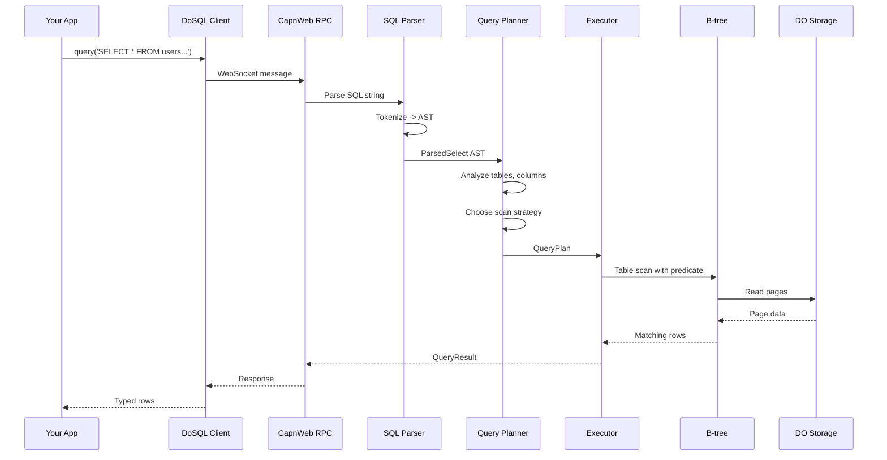
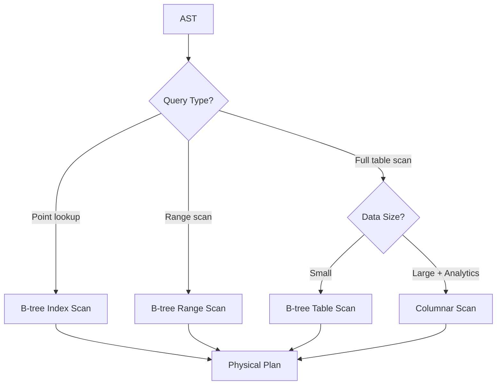
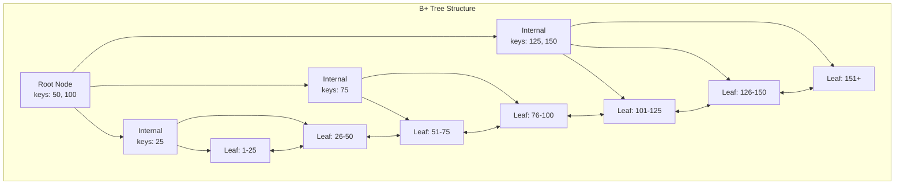
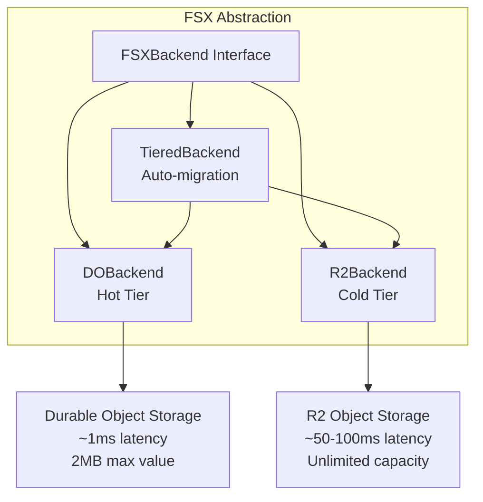
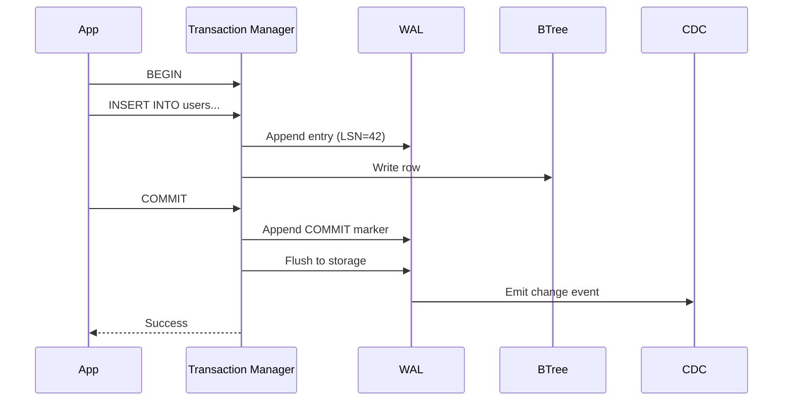
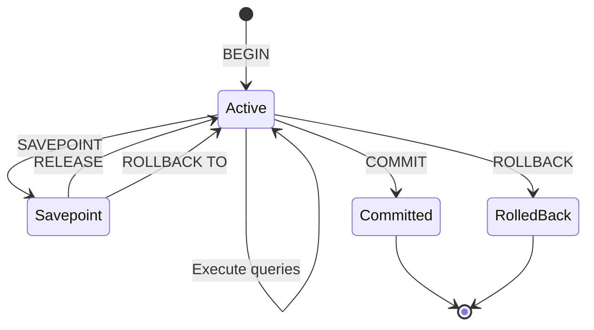
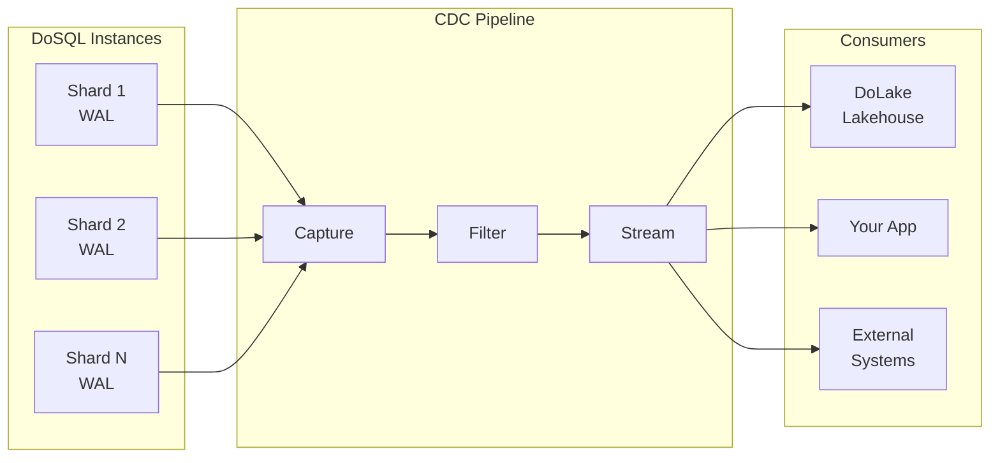
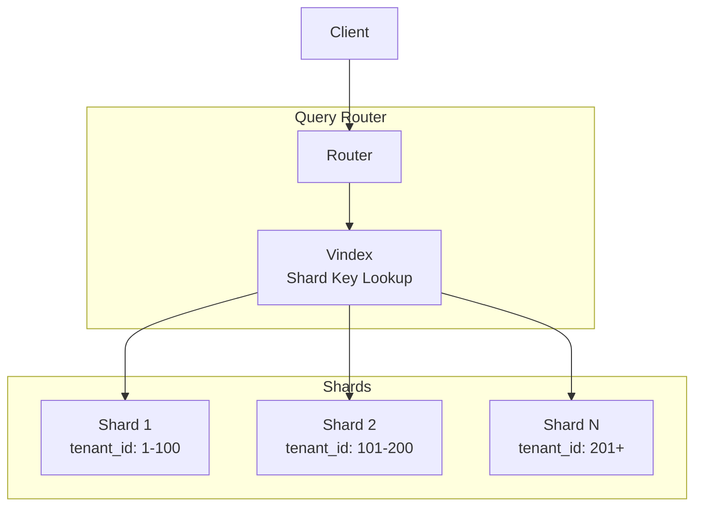

# DoSQL Architecture Overview

This guide explains how DoSQL works under the hood. Whether you're evaluating DoSQL for your project, debugging an issue, or contributing to the codebase, this document will help you understand the key design decisions and how the pieces fit together.

## What is DoSQL?

DoSQL is a SQL database engine built from scratch for Cloudflare Workers. Unlike traditional databases that rely on WebAssembly ports (like SQLite-WASM or PGLite), DoSQL is written entirely in TypeScript and designed specifically for Cloudflare's Durable Objects platform.

**Key insight**: By building natively for Durable Objects instead of porting an existing database, DoSQL achieves a 7KB bundle size versus 500KB-4MB for WASM alternatives.

## High-Level Architecture

At its core, DoSQL follows a classic database architecture with some important adaptations for the edge computing environment:

```
                    Your Application
                          |
                          v
           +------------------------------+
           |         DoSQL Client         |
           |    (@dotdo/sql.do SDK)       |
           +------------------------------+
                          |
                   WebSocket/HTTP
                   (CapnWeb RPC)
                          |
                          v
+----------------------------------------------------------+
|                   Cloudflare Workers                      |
|  +----------------------------------------------------+  |
|  |                    DoSQL Engine                     |  |
|  |                 (Durable Object)                    |  |
|  |                                                     |  |
|  |  +-------+    +--------+    +----------+           |  |
|  |  |Parser | -> |Planner | -> |Executor  |           |  |
|  |  +-------+    +--------+    +----------+           |  |
|  |                                  |                  |  |
|  |            +---------------------+                  |  |
|  |            |                     |                  |  |
|  |            v                     v                  |  |
|  |      +---------+           +---------+             |  |
|  |      | B-tree  |           |Columnar |             |  |
|  |      |  (OLTP) |           | (OLAP)  |             |  |
|  |      +---------+           +---------+             |  |
|  |            |                     |                  |  |
|  |            +---------------------+                  |  |
|  |                      |                              |  |
|  |                      v                              |  |
|  |  +----------------------------------------------+  |  |
|  |  |              Storage Layer (FSX)              |  |  |
|  |  |   +----------+    +----------+    +-------+   |  |  |
|  |  |   |    DO    |    |    R2    |    |Tiered |   |  |  |
|  |  |   |  (Hot)   | -> | (Cold)   | <- |Manager|   |  |  |
|  |  |   +----------+    +----------+    +-------+   |  |  |
|  |  +----------------------------------------------+  |  |
|  +----------------------------------------------------+  |
+----------------------------------------------------------+
```

## How a Query Executes

When you run a SQL query, it flows through several stages. Let's trace a simple query:

```typescript
const users = await db.query('SELECT * FROM users WHERE active = ?', [true]);
```



### Stage 1: Parsing

The parser transforms your SQL string into an Abstract Syntax Tree (AST):

```
SQL: "SELECT * FROM users WHERE active = ?"

         SelectStatement
              |
    +---------+---------+
    |         |         |
  columns   table     where
    |         |         |
   [*]     "users"    active = ?
```

**Key files**: `src/parser/unified.ts`, `src/parser/shared/tokenizer.ts`

### Stage 2: Planning

The planner analyzes the AST and decides how to execute the query efficiently:

1. **Table resolution**: Verifies tables exist, resolves schemas
2. **Column validation**: Checks all referenced columns are valid
3. **Index selection**: Determines if indexes can speed up the query
4. **Path selection**: Chooses between B-tree (OLTP) or columnar (OLAP) scan



**Key files**: `src/planner/index.ts`, `src/planner/stats.ts`

### Stage 3: Execution

The executor transforms the plan into a tree of operators that produce rows:

```
        ProjectOperator (SELECT columns)
              |
        FilterOperator (WHERE clause)
              |
        ScanOperator (read from storage)
```

Each operator follows a **pull-based** model:
- The top operator calls `next()` on its child
- The child produces rows on demand
- Rows flow upward through the tree

This approach is memory-efficient because it processes one row at a time rather than materializing entire result sets.

**Key files**: `src/engine/executor.ts`, `src/engine/operators/`

## Core Components

### B-tree Index

The B-tree is DoSQL's primary data structure for OLTP workloads. It's a B+ tree implementation optimized for Durable Object storage:



**Why a custom B-tree?**
- Durable Object storage has a 2MB value limit
- Pages are sized to fit within this constraint
- Linked leaf nodes enable efficient range scans
- Custom key/value codecs support any data type

**Key files**: `src/btree/`

### Columnar Storage

For analytical queries over large datasets, DoSQL uses columnar storage:

```
Row-oriented (B-tree):        Column-oriented:
+----+------+-------+         id:    [1, 2, 3, 4, 5...]
| id | name | sales |         name:  [Alice, Bob, Carol...]
+----+------+-------+         sales: [100, 200, 150, 300...]
| 1  | Alice| 100   |
| 2  | Bob  | 200   |
| 3  | Carol| 150   |
```

Columnar storage is faster for analytics because:
- Queries only read needed columns
- Better compression (similar values together)
- Zone maps enable predicate pushdown (skip irrelevant data)

**Key files**: `src/columnar/`

### Storage Layer (FSX)

The FSX abstraction provides a unified interface over different storage backends:



**Tiered Storage Flow**:

1. **Writes** go to hot tier (DO storage) for low latency
2. **Background migration** moves old/large data to cold tier (R2)
3. **Reads** check hot tier first, then cold tier

This gives you fast access to recent data while supporting unlimited storage capacity.

**Key files**: `src/fsx/`

### Write-Ahead Log (WAL)

The WAL ensures durability by recording all changes before they're applied:



**WAL Entry Format**:
```
+--------+--------+--------+--------+--------+--------+
| LSN    | TxnId  |  Op    | Table  | Key    | Value  |
| bigint | string | enum   | string | bytes  | bytes  |
+--------+--------+--------+--------+--------+--------+
```

The WAL enables:
- **Crash recovery**: Replay uncommitted transactions
- **Point-in-time recovery**: Restore to any LSN
- **CDC streaming**: Derive change events from WAL entries

**Key files**: `src/wal/`

### Transaction Manager

DoSQL provides full ACID transactions with savepoint support:



**Isolation Levels**:
- **SERIALIZABLE** (default): Full isolation, no anomalies
- **SNAPSHOT**: Read from consistent snapshot, write conflicts detected

**Key files**: `src/transaction/`

## Change Data Capture (CDC)

CDC captures all database changes and streams them to consumers:



**CDC Event Format**:
```typescript
interface ChangeEvent {
  type: 'insert' | 'update' | 'delete';
  table: string;
  lsn: bigint;          // Logical sequence number
  txnId: string;        // Transaction ID
  timestamp: Date;
  before?: Record<string, unknown>;  // Previous values (update/delete)
  after?: Record<string, unknown>;   // New values (insert/update)
}
```

**Key files**: `src/cdc/`

## Sharding Architecture

For large-scale deployments, DoSQL supports automatic sharding:



**Vindex Types**:

| Type | Use Case | How It Works |
|------|----------|--------------|
| HASH | Even distribution | Consistent hash of shard key |
| RANGE | Range queries | Key ranges mapped to shards |
| LOOKUP | Flexible routing | External lookup table |
| REGION | Geo-affinity | Geographic zone mapping |

**Query Routing**:

1. **Single-shard**: Query includes shard key, route to one shard
2. **Scatter-gather**: No shard key, query all shards and merge results

**Key files**: `src/sharding/`

## Storage Tiers

DoSQL implements a three-tier storage architecture:

```
+-------------------------------------------------------------------------+
|                              Storage Tiers                               |
+-------------------------------------------------------------------------+
|                                                                          |
|   HOT TIER (Durable Object Storage)                                     |
|   +------------------------------------------------------------------+  |
|   | Latency: ~1ms | Max Value: 2MB | Consistency: Strong             |  |
|   | Contents: WAL segments, B-tree pages, active indexes             |  |
|   +------------------------------------------------------------------+  |
|                                  |                                       |
|                                  | Migration (age/size threshold)        |
|                                  v                                       |
|   WARM TIER (R2 with Cache)                                             |
|   +------------------------------------------------------------------+  |
|   | Latency: ~50-100ms | Capacity: Unlimited | Format: Binary pages  |  |
|   | Contents: Overflow pages, archived indexes, large blobs          |  |
|   +------------------------------------------------------------------+  |
|                                  |                                       |
|                                  | CDC streaming                         |
|                                  v                                       |
|   COLD TIER (Parquet/Iceberg on R2)                                     |
|   +------------------------------------------------------------------+  |
|   | Latency: ~100-500ms | Capacity: Unlimited | Format: Columnar     |  |
|   | Contents: Analytics data, historical snapshots, CDC archive      |  |
|   +------------------------------------------------------------------+  |
|                                                                          |
+-------------------------------------------------------------------------+
```

**Performance Summary**:

| Tier | Read Latency (p50) | Write Latency | Capacity |
|------|-------------------|---------------|----------|
| Hot (DO) | 0.5-1ms | 1-2ms | ~100MB |
| Warm (R2+Cache) | 1-50ms | 20-40ms | Unlimited |
| Cold (Iceberg) | 100-300ms | 200-500ms | Unlimited |

## Why This Architecture Matters

### For Application Developers

1. **Predictable Performance**: The tiered storage ensures hot data stays fast
2. **Unlimited Scale**: Cold tier provides infinite storage for historical data
3. **Real-time CDC**: Build reactive applications with change streaming
4. **Type Safety**: TypeScript-native means better tooling and fewer bugs

### For Operations Teams

1. **No Infrastructure**: Runs entirely on Cloudflare's managed platform
2. **Auto-scaling**: Durable Objects scale automatically
3. **Global Distribution**: Deploy close to users worldwide
4. **Cost Efficiency**: Pay only for what you use, hibernate idle connections

### For Data Teams

1. **Iceberg Integration**: Query historical data with Spark, Trino, DuckDB
2. **CDC Streaming**: Build real-time data pipelines
3. **Time Travel**: Query data at any point in history
4. **Schema Evolution**: Iceberg handles schema changes gracefully

## Bundle Size Comparison

DoSQL's native TypeScript approach results in dramatically smaller bundles:

| Database | Bundle Size (gzipped) |
|----------|----------------------|
| DoSQL | **7 KB** |
| SQLite-WASM | ~500 KB |
| PGLite | ~3 MB |
| DuckDB-WASM | ~4 MB |

This matters because:
- Cloudflare Workers have a 1MB bundle limit (free tier)
- Smaller bundles mean faster cold starts
- Less code to load and parse

## Component Summary

| Component | Location | Responsibility |
|-----------|----------|----------------|
| SQL Parser | `src/parser/` | SQL string to AST |
| Query Planner | `src/planner/` | AST to physical plan |
| Executor | `src/engine/` | Execute plan, produce rows |
| B-tree | `src/btree/` | OLTP storage, indexes |
| Columnar | `src/columnar/` | OLAP storage, analytics |
| FSX | `src/fsx/` | Storage abstraction layer |
| WAL | `src/wal/` | Durability, recovery |
| Transactions | `src/transaction/` | ACID guarantees |
| CDC | `src/cdc/` | Change data capture |
| Sharding | `src/sharding/` | Distributed queries |
| RPC | `src/rpc/` | Client-server communication |

## Further Reading

- [Getting Started](./getting-started.md) - Installation and basic usage
- [API Reference](./api-reference.md) - Complete API documentation
- [Advanced Features](./advanced.md) - Time travel, branching, CDC, vector search
