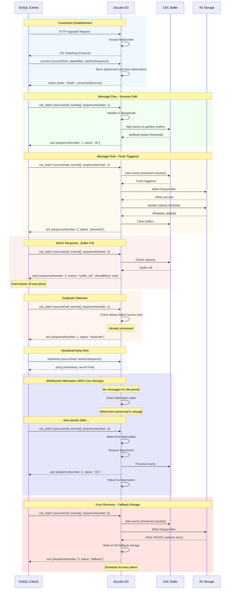
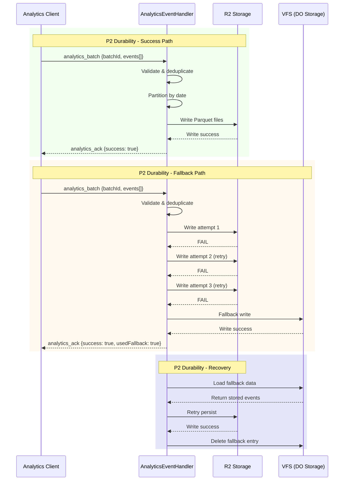

# DoLake Architecture

This document describes the architecture and design of DoLake, a lakehouse component that bridges real-time CDC streams from DoSQL to the open Iceberg table format on Cloudflare R2.

## System Overview

```
+-------------------------------------------------------------------------+
|                        DoSQL Instances (Shards)                          |
|  +----------+  +----------+  +----------+  +----------+  +----------+   |
|  | Shard 1  |  | Shard 2  |  | Shard 3  |  | Shard N  |  |   ...    |   |
|  |  (JSON)  |  |  (JSON)  |  |  (JSON)  |  |  (JSON)  |  |          |   |
|  +----+-----+  +----+-----+  +----+-----+  +----+-----+  +----+-----+   |
|       |             |             |             |             |          |
|       | WebSocket   | Hibernation | (95% cost  discount)     |          |
|       v             v             v             v             v          |
|  +------------------------------------------------------------------+   |
|  |                       DoLake (Aggregator DO)                      |   |
|  |                                                                    |   |
|  |  +-------------------+  +-------------------+  +----------------+  |   |
|  |  | CDC Buffer Mgr    |  | Parquet Writer    |  | REST Catalog   |  |   |
|  |  | - Table buffers   |  | - Schema infer    |  | - Iceberg API  |  |   |
|  |  | - Deduplication   |  | - Column encode   |  | - Namespaces   |  |   |
|  |  | - Flush triggers  |  | - Statistics      |  | - Tables       |  |   |
|  |  +-------------------+  +-------------------+  +----------------+  |   |
|  |                                                                    |   |
|  |  +-------------------+  +-------------------+  +----------------+  |   |
|  |  | Iceberg Metadata  |  | R2 Storage        |  |CacheInvalidator|  |   |
|  |  | - Snapshots       |  | - Data files      |  | - Invalidation |  |   |
|  |  | - Manifests       |  | - Metadata files  |  | - Notifications|  |   |
|  |  | - Schema history  |  | - Manifest lists  |  +----------------+  |   |
|  |  +-------------------+  +-------------------+                      |   |
|  +------------------------------------------------------------------+   |
|                                    |                                     |
|                                    v                                     |
|                              +-----------+                               |
|                              |    R2     |                               |
|                              | (Iceberg) |                               |
|                              +-----------+                               |
|                                    |                                     |
|                                    v                                     |
|  +------------------------------------------------------------------+   |
|  |                   External Query Engines                          |   |
|  |   Spark   |   DuckDB   |   Trino   |   Flink   |   DataFusion    |   |
|  +------------------------------------------------------------------+   |
+-------------------------------------------------------------------------+
```

## Core Components

### 1. DoLake Durable Object

The main Durable Object that orchestrates all lakehouse operations:

```
+-------------------------------------------------------------------+
|                         DoLake DO                                  |
|                                                                    |
|  State:                                                            |
|  +------------------+  +------------------+  +------------------+  |
|  | idle             |  | receiving        |  | flushing         |  |
|  | No active work   |  | Processing CDC   |  | Writing to R2    |  |
|  +------------------+  +------------------+  +------------------+  |
|          |                    |                    |               |
|          +--------------------+--------------------+               |
|                               |                                    |
|  Components:                  v                                    |
|  +------------------+  +------------------+  +------------------+  |
|  | CDCBufferManager |  | R2IcebergStorage |  | RestCatalogHndlr|  |
|  +------------------+  +------------------+  +------------------+  |
|  +------------------+                                              |
|  | CacheInvalidator |                                              |
|  | - Invalidation   |                                              |
|  | - Notifications  |                                              |
|  +------------------+                                              |
+-------------------------------------------------------------------+
```

### 2. CDC Buffer Manager

Manages buffering, batching, and deduplication of incoming CDC events:

```
                          CDC Events In
                               |
                               v
                    +---------------------+
                    | Deduplication Check |
                    | (batch:sourceId:seq)|
                    +----------+----------+
                               |
              duplicate?       |
             +--------+--------+--------+
             |                          |
             v                          v
       +----------+            +---------------+
       | Skip/ACK |            | Add to Batch  |
       +----------+            +-------+-------+
                                       |
                                       v
                    +---------------------+
                    | Distribute to       |
                    | Partition Buffers   |
                    +----------+----------+
                               |
        +----------+-----------+-----------+----------+
        |          |           |           |          |
        v          v           v           v          v
   +--------+ +--------+ +--------+ +--------+ +--------+
   | users  | | orders | | users  | | orders | | events |
   | dt=01  | | dt=01  | | dt=02  | | dt=02  | | (none) |
   +--------+ +--------+ +--------+ +--------+ +--------+
```

**Buffer Structure:**

```
PartitionBuffer {
  table: string           // e.g., "users"
  partitionKey: string    // e.g., "dt=2026-01-21"
  events: CDCEvent[]      // Buffered events
  sizeBytes: number       // Estimated size
  firstEventTime: number  // For age-based flush
  lastEventTime: number
}
```

### 3. Flush Pipeline

When flush triggers fire, data flows through the flush pipeline:

```
                    Flush Trigger
                    (events/size/time)
                          |
                          v
              +------------------------+
              | Get Partition Buffers  |
              +------------------------+
                          |
                          v
              +------------------------+
              | Group by Table         |
              +------------------------+
                          |
           +--------------+--------------+
           |              |              |
           v              v              v
    +------------+  +------------+  +------------+
    | Table: A   |  | Table: B   |  | Table: C   |
    +------------+  +------------+  +------------+
           |              |              |
           v              v              v
    +------------+  +------------+  +------------+
    | Infer/Get  |  | Infer/Get  |  | Infer/Get  |
    | Schema     |  | Schema     |  | Schema     |
    +------------+  +------------+  +------------+
           |              |              |
           v              v              v
    +------------+  +------------+  +------------+
    | Write      |  | Write      |  | Write      |
    | Parquet    |  | Parquet    |  | Parquet    |
    +------------+  +------------+  +------------+
           |              |              |
           v              v              v
    +------------+  +------------+  +------------+
    | Upload R2  |  | Upload R2  |  | Upload R2  |
    +------------+  +------------+  +------------+
           |              |              |
           +--------------+--------------+
                          |
                          v
              +------------------------+
              | Create Snapshot        |
              | Update Metadata        |
              +------------------------+
                          |
                          v
              +------------------------+
              | Clear Buffers          |
              | Mark Persisted         |
              +------------------------+
```

### 4. WebSocket Connection Management

DoLake uses WebSocket Hibernation for cost-efficient connection handling:

```
+--------------------+                    +--------------------+
|     DoSQL DO       |                    |     DoLake DO      |
|                    |                    |                    |
|  +-------------+   |    Upgrade         |   +-----------+    |
|  | CDC Stream  +---+------------------->+   | Accept    |    |
|  +-------------+   |                    |   | WebSocket |    |
|                    |                    |   +-----+-----+    |
|                    |                    |         |          |
|                    |                    |         v          |
|                    |                    |   +-----------+    |
|                    |    Attachment      |   | Store     |    |
|                    |    (sourceDoId,    |   | Attach-   |    |
|                    |     lastAckSeq,    |   | ment      |    |
|                    |     capabilities)  |   +-----------+    |
|                    |                    |         |          |
|  +-------------+   |    cdc_batch       |         v          |
|  | Send Batch  +---+------------------->+   +-----------+    |
|  +-------------+   |                    |   | Process   |    |
|                    |                    |   | Message   |    |
|                    |    ack/nack        |   +-----+-----+    |
|  +-------------+   |<-------------------+         |          |
|  | Handle ACK  |   |                    |         v          |
|  +-------------+   |                    |   +-----------+    |
|                    |                    |   | Hibernate |    |
|                    |    (idle period)   |   | (95% cost |    |
|                    |                    |   |  savings) |    |
|                    |                    |   +-----------+    |
+--------------------+                    +--------------------+
```

**WebSocket Attachment Schema (survives hibernation):**

DoLake uses WebSocket attachments to persist connection state across hibernation cycles. When a Durable Object hibernates, all in-memory state is lost, but WebSocket attachments are automatically preserved and restored when the DO wakes up.

```typescript
/**
 * Base attachment - core CDC connection state
 * Defined in: packages/dolake/src/types.ts
 */
interface WebSocketAttachment {
  /** ID of the connected source DO (e.g., DoSQL instance ID) */
  sourceDoId: string;

  /** Human-readable name of the source shard (optional) */
  sourceShardName?: string | undefined;

  /** Last acknowledged sequence number - used for:
   *  - Resumption after reconnection
   *  - Deduplication of batches
   *  - At-least-once delivery guarantees
   */
  lastAckSequence: number;

  /** Unix timestamp (ms) when connection was established */
  connectedAt: number;

  /** Protocol version for compatibility negotiation */
  protocolVersion: number;

  /** Bit-encoded client capabilities:
   *  - 0x01: BINARY_PROTOCOL - Client supports binary encoding
   *  - 0x02: COMPRESSION - Client supports compression
   *  - 0x04: BATCHING - Client supports event batching
   */
  capabilityFlags: number;
}

/**
 * Extended attachment - includes rate limiting context
 * Defined in: packages/dolake/src/websocket-handler.ts
 */
interface ExtendedWebSocketAttachment extends WebSocketAttachment {
  /** Client IP address (from CF-Connecting-IP header) */
  clientIp?: string | undefined;

  /** Unique connection ID for rate limit tracking */
  connectionId: string;
}
```

**What Data is Preserved During Hibernation:**

| Field | Purpose | Restored On Wake |
|-------|---------|------------------|
| `sourceDoId` | Identifies the CDC event source | Yes - for routing events |
| `sourceShardName` | Human-readable identification | Yes - for logging/monitoring |
| `lastAckSequence` | Resumption point for CDC stream | Yes - critical for at-least-once delivery |
| `connectedAt` | Connection age tracking | Yes - for idle timeout decisions |
| `protocolVersion` | Protocol compatibility | Yes - for message encoding |
| `capabilityFlags` | Feature negotiation | Yes - for optimal encoding |
| `clientIp` | Rate limit tracking | Yes - for per-IP limits |
| `connectionId` | Rate limiter state lookup | Yes - for connection-level limits |

**Capability Flags Encoding:**

```typescript
const CapabilityFlags = {
  BINARY_PROTOCOL: 0x01,  // Bit 0: Binary protocol support
  COMPRESSION: 0x02,      // Bit 1: Compression support
  BATCHING: 0x04,         // Bit 2: Batching support
};

// Encode capabilities to flags
function encodeCapabilities(caps: ClientCapabilities): number {
  let flags = 0;
  if (caps.binaryProtocol) flags |= 0x01;
  if (caps.compression) flags |= 0x02;
  if (caps.batching) flags |= 0x04;
  return flags;
}

// Decode flags to capabilities
function decodeCapabilities(flags: number): Partial<ClientCapabilities> {
  return {
    binaryProtocol: (flags & 0x01) !== 0,
    compression: (flags & 0x02) !== 0,
    batching: (flags & 0x04) !== 0,
  };
}
```

**Attachment Lifecycle:**

1. **On WebSocket Accept**: Create attachment with initial state
   ```typescript
   const attachment: ExtendedWebSocketAttachment = {
     sourceDoId: clientId,
     sourceShardName: request.headers.get('X-Shard-Name'),
     lastAckSequence: 0,
     connectedAt: Date.now(),
     protocolVersion: 1,
     capabilityFlags: 0,
     clientIp: request.headers.get('CF-Connecting-IP'),
     connectionId: crypto.randomUUID(),
   };
   ctx.acceptWebSocket(server, [clientId]);
   server.serializeAttachment(attachment);
   ```

2. **On Message Received**: Update attachment state
   ```typescript
   // After processing cdc_batch message
   attachment.lastAckSequence = message.sequenceNumber;
   ws.serializeAttachment(attachment);
   ```

3. **On Hibernation Wake**: Restore attachment
   ```typescript
   async webSocketMessage(ws: WebSocket, message: ArrayBuffer | string) {
     const attachment = ws.deserializeAttachment() as WebSocketAttachment;
     // attachment is fully restored from hibernation storage
     // Continue processing from lastAckSequence
   }
   ```

4. **On Connection Close**: Clean up rate limiter state
   ```typescript
   async webSocketClose(ws: WebSocket, code: number, reason: string) {
     const attachment = ws.deserializeAttachment() as ExtendedWebSocketAttachment;
     rateLimiter.unregisterConnection(attachment.connectionId);
   }
   ```

### WebSocket Message Flow Sequence

The following sequence diagram illustrates the complete WebSocket message flow between a DoSQL client and DoLake, including connection establishment, message handling, ACK/NACK responses, and hibernation:



**Key Sequence Points:**

1. **Connection Establishment**: The client initiates an HTTP upgrade, and upon acceptance, sends a `connect` message with its identity and capabilities. The attachment is stored to survive hibernation.

2. **ACK Responses**: Successful batch processing returns an `ack` with status:
   - `ok`: Batch processed and buffered
   - `persisted`: Batch triggered flush and data written to R2
   - `duplicate`: Batch already processed (idempotent)
   - `fallback`: Batch stored in fallback due to R2 failure

3. **NACK Responses**: Failed processing returns a `nack` with:
   - `reason`: Why the batch was rejected
   - `shouldRetry`: Whether the client should retry

4. **Hibernation**: After processing, DoLake enters hibernation to save costs. The WebSocket attachment persists in DO storage, allowing instant resumption when new messages arrive.

## Data Flow

### Write Path (CDC to Iceberg)

```
1. DoSQL generates CDC event
   |
   v
2. WebSocket sends cdc_batch message
   |
   v
3. DoLake receives and validates
   |
   v
4. Deduplication check (batch:source:seq)
   |
   v
5. Add to CDCBufferManager
   |
   v
6. Distribute to partition buffers
   |
   v
7. Check flush triggers
   |
   +---> Not triggered: Send ACK, wait
   |
   v (triggered)
8. Write Parquet files to R2
   |
   v
9. Create manifest entries
   |
   v
10. Create new snapshot
    |
    v
11. Update table metadata in R2
    |
    v
12. Clear buffers, mark persisted
```

### Read Path (Query Engine)

```
1. External engine connects to REST Catalog
   |
   v
2. GET /v1/config - Get catalog configuration
   |
   v
3. GET /v1/namespaces - List available namespaces
   |
   v
4. GET /v1/namespaces/{ns}/tables - List tables
   |
   v
5. GET /v1/namespaces/{ns}/tables/{table} - Load table metadata
   |
   v
6. Parse metadata for current snapshot
   |
   v
7. Read manifest list from R2
   |
   v
8. Read manifest files from R2
   |
   v
9. Read Parquet data files from R2
   |
   v
10. Execute query with predicate pushdown
```

## Storage Layout

DoLake uses the standard Iceberg storage layout in R2:

```
r2://lakehouse-bucket/
└── warehouse/                          # Base path
    ├── default/                        # Namespace
    │   ├── users/                      # Table
    │   │   ├── metadata/
    │   │   │   ├── v1.metadata.json    # Initial metadata
    │   │   │   ├── v2.metadata.json    # After first flush
    │   │   │   ├── v3.metadata.json    # After second flush
    │   │   │   ├── snap-{id}-manifest-list.avro
    │   │   │   └── {uuid}-manifest.avro
    │   │   └── data/
    │   │       ├── dt=2026-01-20/
    │   │       │   ├── {uuid}.parquet
    │   │       │   └── {uuid}.parquet
    │   │       └── dt=2026-01-21/
    │   │           └── {uuid}.parquet
    │   └── orders/                     # Another table
    │       ├── metadata/
    │       └── data/
    └── analytics/                      # Another namespace
        └── events/
            ├── metadata/
            └── data/
```

## Iceberg Metadata Structure

### Table Metadata

```json
{
  "format-version": 2,
  "table-uuid": "550e8400-e29b-41d4-a716-446655440000",
  "location": "warehouse/default/users",
  "last-sequence-number": 5,
  "last-updated-ms": 1705840000000,
  "last-column-id": 8,
  "current-schema-id": 0,
  "schemas": [
    {
      "type": "struct",
      "schema-id": 0,
      "fields": [
        {"id": 1, "name": "_cdc_sequence", "type": "long", "required": true},
        {"id": 2, "name": "_cdc_timestamp", "type": "timestamptz", "required": true},
        {"id": 3, "name": "_cdc_operation", "type": "string", "required": true},
        {"id": 4, "name": "_cdc_row_id", "type": "string", "required": true},
        {"id": 5, "name": "id", "type": "string", "required": false},
        {"id": 6, "name": "name", "type": "string", "required": false},
        {"id": 7, "name": "email", "type": "string", "required": false},
        {"id": 8, "name": "created_at", "type": "timestamptz", "required": false}
      ]
    }
  ],
  "current-snapshot-id": 1705840000000000123,
  "snapshots": [...],
  "snapshot-log": [...]
}
```

### Snapshot

```json
{
  "snapshot-id": 1705840000000000123,
  "parent-snapshot-id": null,
  "sequence-number": 1,
  "timestamp-ms": 1705840000000,
  "manifest-list": "warehouse/default/users/metadata/snap-1705840000000000123-manifest-list.avro",
  "summary": {
    "operation": "append",
    "added-data-files": "3",
    "added-records": "15000",
    "added-files-size": "1048576"
  }
}
```

## Error Handling & Recovery

### Fallback Storage

When R2 writes fail, DoLake uses local DO storage as fallback:

```
             Normal Path              Fallback Path
                  |                        |
                  v                        v
         +---------------+        +---------------+
         | Write to R2   |        | Write to DO   |
         +-------+-------+        | Storage       |
                 |                +-------+-------+
                 |                        |
          success|              recovery  |
                 |                alarm   |
                 v                        v
         +---------------+        +---------------+
         | Update Meta   |        | Retry to R2   |
         +---------------+        +---------------+
```

### Recovery Flow

```
1. Alarm fires (scheduled)
   |
   v
2. Check for fallback events
   |
   v
3. Load events from DO storage
   |
   v
4. Retry flush to R2
   |
   +---> Success: Clear fallback storage
   |
   +---> Failure: Keep in fallback, schedule retry
```

## Message Protocol

### Client to DoLake Messages

| Type | Description | Fields |
|------|-------------|--------|
| `cdc_batch` | CDC events batch | sourceDoId, events, sequenceNumber |
| `connect` | Connection init | sourceDoId, capabilities, lastAckSequence |
| `heartbeat` | Keep-alive | sourceDoId, lastAckSequence |
| `flush_request` | Request flush | sourceDoId, reason |

### DoLake to Client Messages

| Type | Description | Fields |
|------|-------------|--------|
| `ack` | Batch accepted | sequenceNumber, status, details |
| `nack` | Batch rejected | sequenceNumber, reason, shouldRetry |
| `status` | Status update | state, buffer, connectedSources |
| `pong` | Heartbeat response | timestamp, serverTime |

### ACK Status Values

| Status | Description |
|--------|-------------|
| `ok` | Batch processed successfully |
| `buffered` | Batch added to buffer (high utilization) |
| `persisted` | Batch written to R2 |
| `duplicate` | Batch already processed |
| `fallback` | Batch in fallback storage |

### NACK Reasons

| Reason | Retry? | Description |
|--------|--------|-------------|
| `buffer_full` | Yes | Buffer at capacity |
| `rate_limited` | Yes | Too many requests |
| `invalid_sequence` | No | Sequence number issue |
| `invalid_format` | No | Malformed message |
| `internal_error` | Yes | Server-side error |
| `shutting_down` | Yes | DO is shutting down |

## Performance Considerations

### Buffer Sizing

```
Recommended Buffer Configuration:
+----------------------------+------------------+
| Workload                   | maxBufferSize    |
+----------------------------+------------------+
| Low volume (<1K events/s)  | 32 MB            |
| Medium (1K-10K events/s)   | 64 MB            |
| High (>10K events/s)       | 128 MB           |
+----------------------------+------------------+

Flush Thresholds:
+----------------------------+------------------+
| Threshold Type             | Recommended      |
+----------------------------+------------------+
| Event count                | 10,000           |
| Size                       | 32 MB            |
| Time                       | 60 seconds       |
+----------------------------+------------------+
```

### WebSocket Hibernation

DoLake uses WebSocket Hibernation to minimize costs during idle periods:

- Active connections: Full DO compute costs
- Hibernating connections: 95% cost reduction
- Automatic hibernation after message processing
- Instant wake-up on new messages

### Parquet Optimization

```
Parquet Configuration:
+----------------------------+------------------+
| Setting                    | Default          |
+----------------------------+------------------+
| Row group size             | 100,000 rows     |
| Page size                  | 1 MB             |
| Compression                | Snappy           |
| Dictionary encoding        | Enabled          |
| Statistics                 | Enabled          |
+----------------------------+------------------+
```

## AnalyticsEventHandler P2 Durability Flow

The `AnalyticsEventHandler` implements P2 durability tier for analytics events, providing R2 as primary storage with VFS (Durable Object storage) as fallback. This ensures high durability while maintaining performance for high-volume analytics ingestion.

### P2 Durability Tier Overview

```
+-------------------+     +-------------------+     +-------------------+
| Client Buffer     |     | AnalyticsEvent    |     | Storage Tier      |
| (100 events or    |---->| Handler           |---->| R2 (Primary)      |
|  5s timeout)      |     | - Deduplication   |     | VFS (Fallback)    |
+-------------------+     | - Partitioning    |     +-------------------+
                          | - Retry logic     |
                          +-------------------+
```

**P2 Configuration:**

| Setting | Value | Description |
|---------|-------|-------------|
| Primary Storage | R2 | Cloudflare R2 object storage |
| Fallback Storage | VFS | Durable Object storage |
| Retry Attempts | 3 | Number of R2 retries before fallback |
| Retry Delay | 1000ms | Delay between retry attempts |
| Deduplication Window | 5 minutes | Time window for eventId dedup |

### P2 Durability Flow Diagram

```
                    Analytics Event Batch
                           |
                           v
                +---------------------+
                | Validate Batch      |
                | - batchId present   |
                | - events array valid|
                +----------+----------+
                           |
                           v
                +---------------------+
                | Deduplicate Events  |
                | (by eventId within  |
                |  5-minute window)   |
                +----------+----------+
                           |
            +--------------+--------------+
            |                             |
            v                             v
     +-------------+              +---------------+
     | All Dupes   |              | Unique Events |
     | Return ACK  |              +-------+-------+
     | (skip persist)                     |
     +-------------+                      v
                              +---------------------+
                              | Partition by Date   |
                              | year=YYYY/month=MM/ |
                              | day=DD              |
                              +----------+----------+
                                         |
               +-------------------------+-------------------------+
               |                         |                         |
               v                         v                         v
        +-----------+            +-----------+            +-----------+
        | Partition |            | Partition |            | Partition |
        | 2026/01/20|            | 2026/01/21|            | 2026/01/22|
        +-----+-----+            +-----+-----+            +-----+-----+
              |                        |                        |
              +------------------------+------------------------+
                                       |
                                       v
                           +---------------------+
                           | Write to R2         |
                           | (Primary Storage)   |
                           +----------+----------+
                                      |
                         success?     |
                        +------+------+------+
                        |                    |
                        v                    v
                 +------------+      +---------------+
                 | SUCCESS    |      | RETRY (x3)    |
                 | Return ACK |      | with 1s delay |
                 +------------+      +-------+-------+
                                             |
                                    success? |
                                   +---------+---------+
                                   |                   |
                                   v                   v
                            +------------+     +---------------+
                            | SUCCESS    |     | FALLBACK      |
                            | Return ACK |     | Write to VFS  |
                            +------------+     | (DO Storage)  |
                                               +-------+-------+
                                                       |
                                                       v
                                               +---------------+
                                               | Return ACK    |
                                               | usedFallback: |
                                               | true          |
                                               +---------------+
```

### Client-Side Batching

The `AnalyticsEventBuffer` handles client-side batching with dual flush triggers:

```
                    Event Stream
                         |
                         v
              +---------------------+
              | AnalyticsEventBuffer|
              +----------+----------+
                         |
          +--------------+--------------+
          |                             |
          v                             v
   +---------------+           +---------------+
   | Count Trigger |           | Time Trigger  |
   | >= 100 events |           | >= 5 seconds  |
   +-------+-------+           +-------+-------+
           |                           |
           +-----------+---------------+
                       |
                       v
              +---------------+
              | Flush Batch   |
              | to DoLake     |
              +---------------+
```

### Recovery Flow

When data is stored in VFS fallback, recovery can be triggered:

```
1. Alarm fires (recovery scheduled)
   |
   v
2. Load events from VFS fallback storage
   |
   v
3. Call persistBatch() with R2 context
   |
   v
4. Check result.usedFallback
   |
   +---> false: Recovery SUCCESS
   |            - Delete VFS fallback entry
   |            - Return recoveredEvents count
   |
   +---> true: Recovery FAILED
              - Keep VFS fallback entry
              - Schedule retry alarm
```

### Message Flow Integration

The AnalyticsEventHandler integrates with the WebSocket message flow:



### ACK Response Details

| Field | Type | Description |
|-------|------|-------------|
| `type` | `'analytics_ack'` | Response type |
| `batchId` | `string` | Original batch identifier |
| `success` | `boolean` | Whether processing succeeded |
| `eventsProcessed` | `number` | Count of unique events persisted |
| `duplicatesSkipped` | `number` | Count of deduplicated events |

### NACK Response Details

| Field | Type | Description |
|-------|------|-------------|
| `type` | `'analytics_nack'` | Response type |
| `batchId` | `string` | Original batch identifier |
| `success` | `false` | Always false for NACK |
| `eventsProcessed` | `0` | Always 0 for NACK |
| `error` | `string` | Error description |

### Metrics Tracking

The handler tracks the following metrics:

| Metric | Description |
|--------|-------------|
| `batchesReceived` | Total batches processed |
| `eventsReceived` | Total unique events (after dedup) |
| `bytesReceived` | Total bytes received |
| `r2Writes` | Successful R2 write operations |
| `vfsFallbacks` | Times VFS fallback was used |
| `errors` | Total error count |

## Scaling

DoLake is designed for horizontal scaling through multiple instances:

```
                     +------------------+
                     |  Load Balancer   |
                     +--------+---------+
                              |
       +----------------------+----------------------+
       |                      |                      |
       v                      v                      v
+-------------+        +-------------+        +-------------+
| DoLake      |        | DoLake      |        | DoLake      |
| Instance A  |        | Instance B  |        | Instance C  |
| (users,     |        | (orders,    |        | (events,    |
|  products)  |        |  inventory) |        |  logs)      |
+------+------+        +------+------+        +------+------+
       |                      |                      |
       +----------------------+----------------------+
                              |
                              v
                    +-----------------+
                    |   R2 Bucket     |
                    | (Shared Store)  |
                    +-----------------+
```

**Partitioning Strategies:**

1. **By Table**: Each DoLake handles specific tables
2. **By Namespace**: Each DoLake handles a namespace
3. **By Shard Range**: Each DoLake handles specific DoSQL shards
