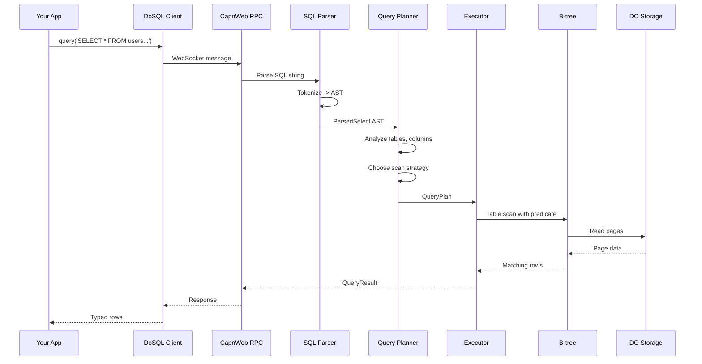
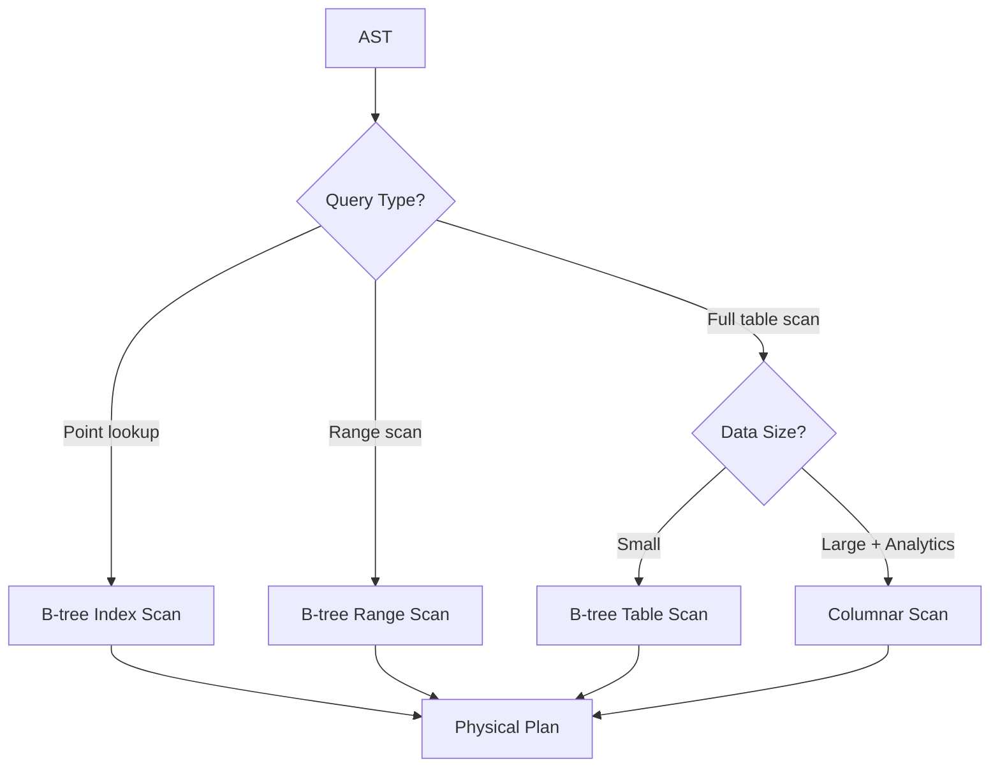
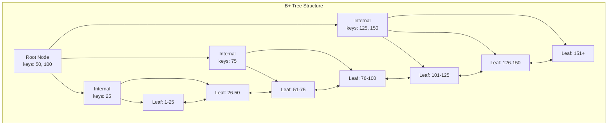
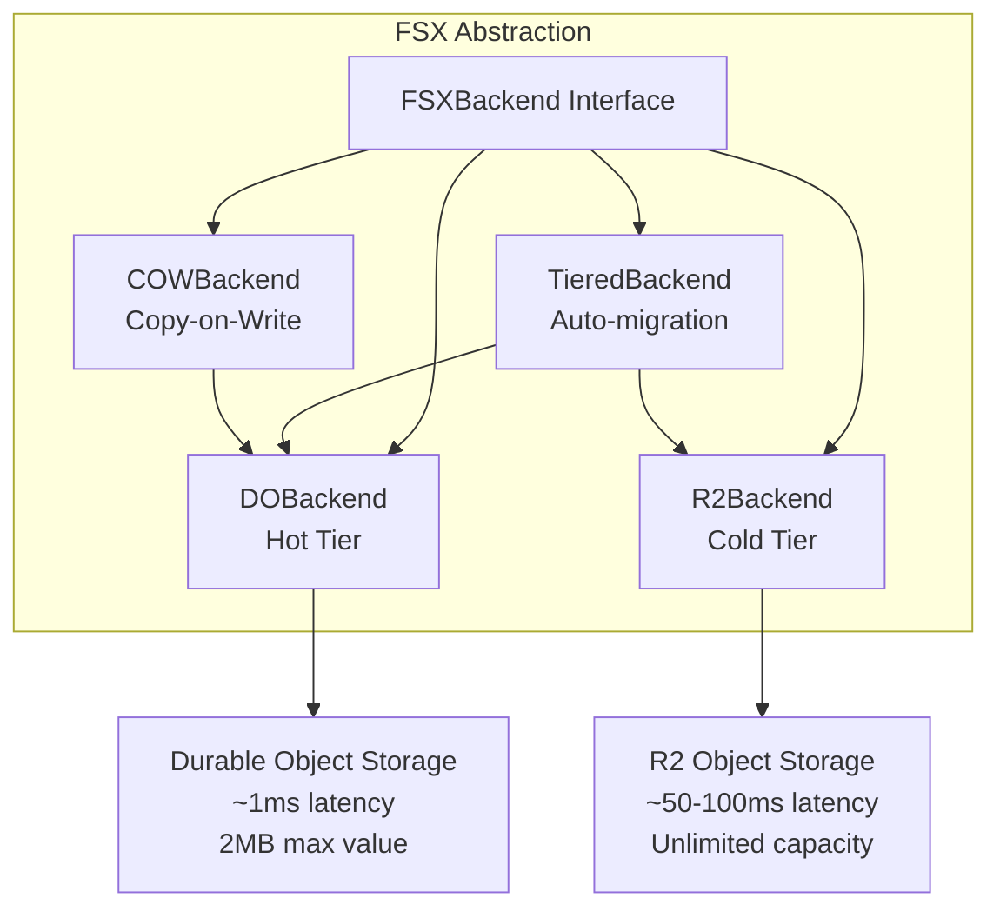
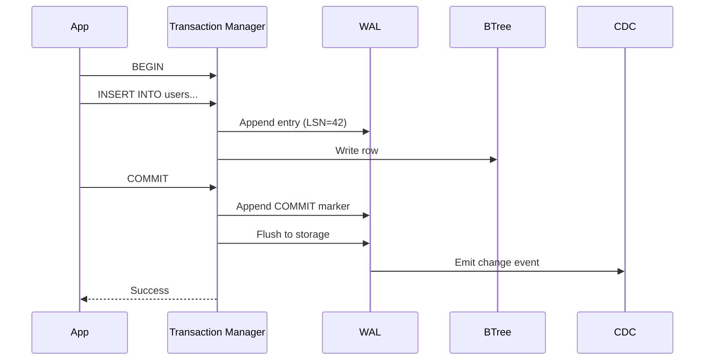
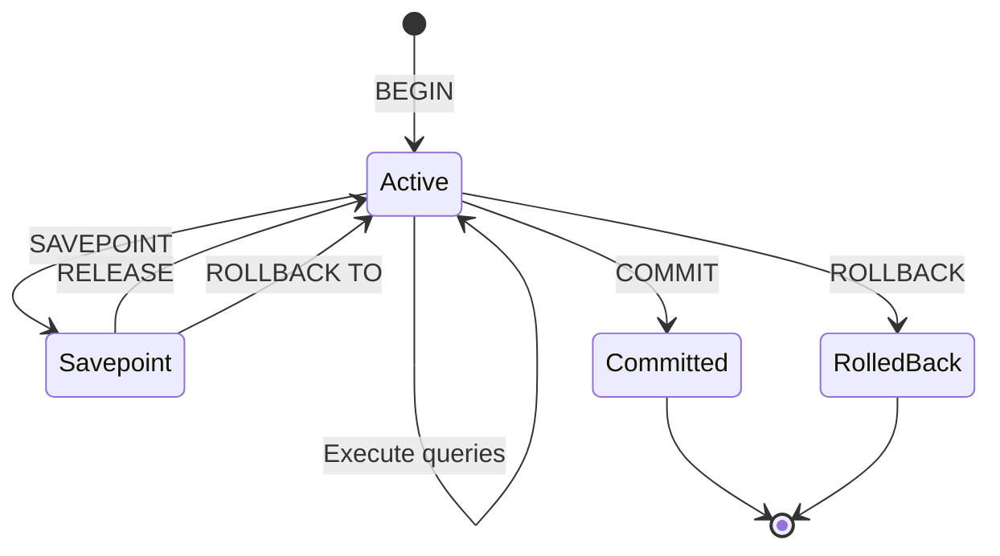
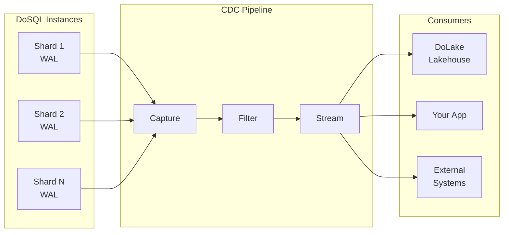
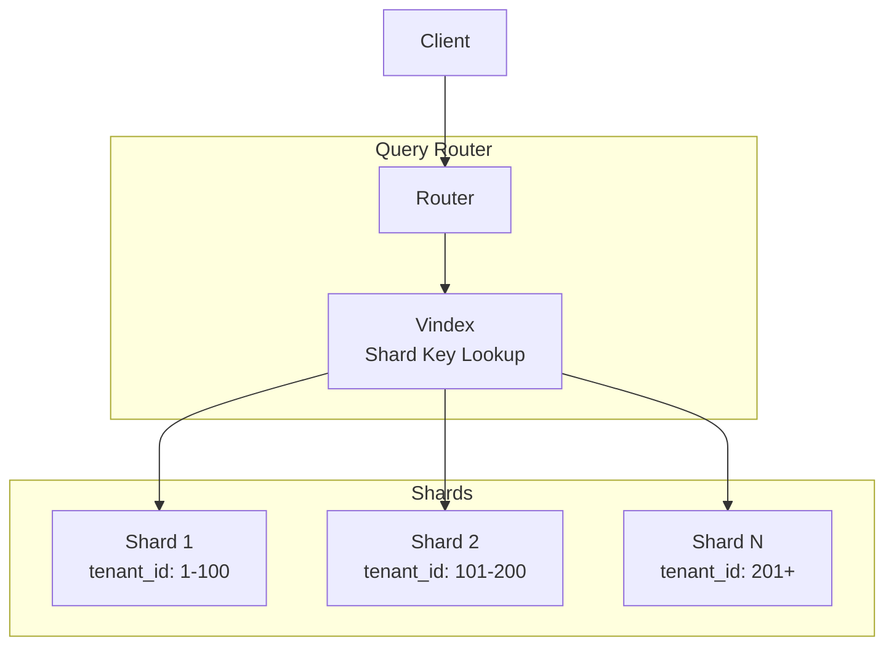

# DoSQL Architecture Overview

This guide explains how DoSQL works under the hood. Whether you are evaluating DoSQL for your project, debugging an issue, or contributing to the codebase, this document will help you understand the key design decisions and how the pieces fit together.

## What is DoSQL?

DoSQL is a SQL database engine built from scratch for Cloudflare Workers. Unlike traditional databases that rely on WebAssembly ports (like SQLite-WASM or PGLite), DoSQL is written entirely in TypeScript and designed specifically for Cloudflare's Durable Objects platform.

**Key insight**: By building natively for Durable Objects instead of porting an existing database, DoSQL achieves a 7 KB bundle size versus 500 KB to 4 MB for WASM alternatives.

## High-Level Architecture

At its core, DoSQL follows a classic database architecture with important adaptations for the edge computing environment:

```
                    Your Application
                          |
                          v
           +------------------------------+
           |         DoSQL Client         |
           |       (dosql package)        |
           +------------------------------+
                          |
                   WebSocket/HTTP
                   (CapnWeb RPC)
                          |
                          v
+----------------------------------------------------------+
|                   Cloudflare Workers                      |
|  +----------------------------------------------------+  |
|  |                    DoSQL Engine                     |  |
|  |                 (Durable Object)                    |  |
|  |                                                     |  |
|  |  +-------+    +--------+    +----------+           |  |
|  |  |Parser | -> |Planner | -> |Executor  |           |  |
|  |  +-------+    +--------+    +----------+           |  |
|  |                                  |                  |  |
|  |            +---------------------+                  |  |
|  |            |                     |                  |  |
|  |            v                     v                  |  |
|  |      +---------+           +---------+             |  |
|  |      | B-tree  |           |Columnar |             |  |
|  |      |  (OLTP) |           | (OLAP)  |             |  |
|  |      +---------+           +---------+             |  |
|  |            |                     |                  |  |
|  |            +---------------------+                  |  |
|  |                      |                              |  |
|  |                      v                              |  |
|  |  +----------------------------------------------+  |  |
|  |  |              Storage Layer (FSX)              |  |  |
|  |  |   +----------+    +----------+    +-------+   |  |  |
|  |  |   |    DO    |    |    R2    |    |Tiered |   |  |  |
|  |  |   |  (Hot)   | -> | (Cold)   | <- |Manager|   |  |  |
|  |  |   +----------+    +----------+    +-------+   |  |  |
|  |  +----------------------------------------------+  |  |
|  +----------------------------------------------------+  |
+----------------------------------------------------------+
```

## How a Query Executes

When you run a SQL query, it flows through several stages. Let's trace a simple query:

```typescript
const users = await db.query('SELECT * FROM users WHERE active = ?', [true]);
```



### Stage 1: Parsing

The parser transforms your SQL string into an Abstract Syntax Tree (AST):

```
SQL: "SELECT * FROM users WHERE active = ?"

         SelectStatement
              |
    +---------+---------+
    |         |         |
  columns   table     where
    |         |         |
   [*]     "users"    active = ?
```

The parser is split into specialized modules for different SQL constructs:

- **DDL** (Data Definition Language): `CREATE`, `ALTER`, `DROP` statements
- **DML** (Data Manipulation Language): `SELECT`, `INSERT`, `UPDATE`, `DELETE`
- **CTE** (Common Table Expressions): `WITH` clauses
- **Set Operations**: `UNION`, `INTERSECT`, `EXCEPT`
- **Window Functions**: `OVER`, `PARTITION BY`, `ORDER BY`

**Key files**: `src/parser/unified.ts`, `src/parser/shared/tokenizer.ts`, `src/parser/ddl.ts`, `src/parser/dml.ts`

### Stage 2: Planning

The planner analyzes the AST and decides how to execute the query efficiently:

1. **Table resolution**: Verifies tables exist, resolves schemas
2. **Column validation**: Checks all referenced columns are valid
3. **Index selection**: Determines if indexes can speed up the query
4. **Cost estimation**: Uses statistics to estimate query cost
5. **Path selection**: Chooses between B-tree (OLTP) or columnar (OLAP) scan



The planner includes a cost-based optimizer that considers:

- Table statistics (row counts, value distributions)
- Index selectivity
- Join ordering for multi-table queries
- Predicate pushdown opportunities

**Key files**: `src/planner/optimizer.ts`, `src/planner/stats.ts`, `src/planner/cost.ts`, `src/planner/types.ts`

### Stage 3: Execution

The executor transforms the plan into a tree of operators that produce rows:

```
        ProjectOperator (SELECT columns)
              |
        FilterOperator (WHERE clause)
              |
        ScanOperator (read from storage)
```

Each operator follows a **pull-based iterator model**:

- The top operator calls `next()` on its child
- The child produces rows on demand
- Rows flow upward through the tree

This approach is memory-efficient because it processes one row at a time rather than materializing entire result sets in memory.

**Key files**: `src/engine/executor.ts`, `src/engine/operators/`, `src/engine/planner.ts`, `src/engine/types.ts`

## Core Components

### B-tree Index

The B-tree is DoSQL's primary data structure for OLTP workloads. It is a B+ tree implementation optimized for Durable Object storage:



**Why a custom B-tree?**

- Durable Object storage has a 2 MB value limit per key
- Pages are sized to fit within this constraint
- Linked leaf nodes enable efficient range scans
- Custom key/value codecs support any data type

The B-tree implementation includes:

- **Page management**: Efficient serialization/deserialization of tree nodes
- **LRU caching**: Recently accessed pages stay in memory
- **Split/merge operations**: Automatic tree rebalancing

**Key files**: `src/btree/btree.ts`, `src/btree/page.ts`, `src/btree/types.ts`

### Columnar Storage

For analytical queries over large datasets, DoSQL uses columnar storage:

```
Row-oriented (B-tree):        Column-oriented:
+----+------+-------+         id:    [1, 2, 3, 4, 5...]
| id | name | sales |         name:  [Alice, Bob, Carol...]
+----+------+-------+         sales: [100, 200, 150, 300...]
| 1  | Alice| 100   |
| 2  | Bob  | 200   |
| 3  | Carol| 150   |
```

Columnar storage is faster for analytics because:

- Queries only read the columns they need (projection pushdown)
- Better compression ratios (similar values stored together)
- Zone maps enable predicate pushdown (skip irrelevant chunks)
- SIMD-friendly memory layout for aggregations

The columnar engine organizes data into chunks with metadata that allows skipping entire chunks when they cannot match query predicates.

**Key files**: `src/columnar/chunk.ts`, `src/columnar/encoding.ts`, `src/columnar/reader.ts`, `src/columnar/writer.ts`

### Storage Layer (FSX)

The FSX (File System Abstraction) layer provides a unified interface over different storage backends. This abstraction enables transparent tiered storage with automatic data migration:



**Tiered Storage Flow**:

1. **Writes** always go to the hot tier (DO storage) for low latency
2. **Background migration** moves old or large data to cold tier (R2)
3. **Reads** check hot tier first, then fall back to cold tier
4. **Copy-on-Write** enables time-travel queries and database branching

This architecture gives you fast access to recent data while supporting unlimited storage capacity for historical data.

**Key files**: `src/fsx/do-backend.ts`, `src/fsx/r2-backend.ts`, `src/fsx/tiered.ts`, `src/fsx/tier-migration.ts`, `src/fsx/cow-backend.ts`

### Write-Ahead Log (WAL)

The WAL ensures durability by recording all changes before they are applied:



**WAL Entry Structure**:

```typescript
interface WALEntry {
  lsn: LSN;              // Log Sequence Number (monotonic identifier)
  timestamp: number;     // Unix timestamp (ms)
  txnId: TransactionId;  // Transaction identifier
  op: WALOperation;      // 'INSERT' | 'UPDATE' | 'DELETE' | 'BEGIN' | 'COMMIT' | 'ROLLBACK'
  table: string;         // Target table name
  key?: Uint8Array;      // Primary key for UPDATE/DELETE
  before?: Uint8Array;   // Previous value (enables rollback)
  after?: Uint8Array;    // New value for INSERT/UPDATE
  hlc?: HLCTimestamp;    // Hybrid Logical Clock for causal ordering
}
```

The WAL enables several critical features:

- **Crash recovery**: Replay uncommitted transactions from the last checkpoint
- **Point-in-time recovery**: Restore the database to any LSN
- **CDC streaming**: Derive change events directly from WAL entries
- **Causal ordering**: HLC timestamps ensure correct ordering in distributed scenarios

**Key files**: `src/wal/writer.ts`, `src/wal/reader.ts`, `src/wal/checkpoint.ts`, `src/wal/types.ts`

### Transaction Manager

DoSQL provides full ACID transactions with savepoint support:



**Transaction Modes** (SQLite-compatible):

- **DEFERRED** (default): Locks acquired only when needed
- **IMMEDIATE**: Acquires write lock immediately, preventing other writers
- **EXCLUSIVE**: Acquires exclusive lock, preventing all other access

**Isolation Levels**:

| Level | Description |
|-------|-------------|
| READ_UNCOMMITTED | Dirty reads allowed (lowest isolation) |
| READ_COMMITTED | Only sees committed data |
| REPEATABLE_READ | Consistent reads within transaction |
| SNAPSHOT | MVCC-based snapshot isolation |
| SERIALIZABLE | Full serialization (default, highest isolation) |

The transaction manager uses MVCC (Multi-Version Concurrency Control) to allow readers and writers to operate concurrently without blocking each other.

**Key files**: `src/transaction/manager.ts`, `src/transaction/isolation.ts`, `src/transaction/types.ts`

## Change Data Capture (CDC)

CDC captures all database changes and streams them to consumers in real-time:



**CDC Event Structure**:

```typescript
interface ChangeEvent<T = Record<string, unknown>> {
  operation: 'INSERT' | 'UPDATE' | 'DELETE';
  table: string;
  lsn: bigint;           // Log Sequence Number
  txnId: string;         // Transaction ID
  timestamp: number;     // Unix timestamp (ms)
  before?: T;            // Previous values (UPDATE/DELETE)
  after?: T;             // New values (INSERT/UPDATE)
}
```

**CDC Features**:

- **Replication Slots**: Persistent position tracking for exactly-once delivery
- **Filtering**: Subscribe to specific tables, operations, or custom predicates
- **Batching**: Efficient batch delivery with configurable backpressure
- **Lakehouse Integration**: Direct streaming to Iceberg tables for historical analytics

**Key files**: `src/cdc/capture.ts`, `src/cdc/stream.ts`, `src/cdc/types.ts`

## Sharding Architecture

For large-scale deployments, DoSQL supports automatic sharding inspired by Vitess VSchema:



**Vindex Types**:

| Type | Use Case | How It Works |
|------|----------|--------------|
| HASH | Even distribution | FNV-1a or xxHash of shard key |
| CONSISTENT_HASH | Rebalancing | Virtual nodes minimize data movement |
| RANGE | Range queries | Boundary-based partitioning |

**Table Sharding Types**:

- **sharded**: Data distributed across shards using vindex
- **unsharded**: All data lives in a single designated shard
- **reference**: Data replicated to all shards (for lookup/dimension tables)

**Query Routing**:

1. **Single-shard**: Query includes shard key in WHERE clause, route to one shard
2. **Scatter-gather**: No shard key, query all shards and merge results

The router analyzes each query to determine the optimal routing strategy, minimizing cross-shard operations when possible.

**Key files**: `src/sharding/router.ts`, `src/sharding/vindex.ts`, `src/sharding/executor.ts`, `src/sharding/types.ts`

## Storage Tiers

DoSQL implements a three-tier storage architecture optimized for different access patterns:

```
+-------------------------------------------------------------------------+
|                              Storage Tiers                               |
+-------------------------------------------------------------------------+
|                                                                          |
|   HOT TIER (Durable Object Storage)                                     |
|   +------------------------------------------------------------------+  |
|   | Latency: ~1ms | Max Value: 2MB | Consistency: Strong             |  |
|   | Contents: WAL segments, B-tree pages, active indexes             |  |
|   +------------------------------------------------------------------+  |
|                                  |                                       |
|                                  | Migration (age/size threshold)        |
|                                  v                                       |
|   WARM TIER (R2 with Cache)                                             |
|   +------------------------------------------------------------------+  |
|   | Latency: ~50-100ms | Capacity: Unlimited | Format: Binary pages  |  |
|   | Contents: Overflow pages, archived indexes, large blobs          |  |
|   +------------------------------------------------------------------+  |
|                                  |                                       |
|                                  | CDC streaming                         |
|                                  v                                       |
|   COLD TIER (Parquet/Iceberg on R2)                                     |
|   +------------------------------------------------------------------+  |
|   | Latency: ~100-500ms | Capacity: Unlimited | Format: Columnar     |  |
|   | Contents: Analytics data, historical snapshots, CDC archive      |  |
|   +------------------------------------------------------------------+  |
|                                                                          |
+-------------------------------------------------------------------------+
```

**Performance Summary**:

| Tier | Read Latency (p50) | Write Latency | Capacity | Best For |
|------|-------------------|---------------|----------|----------|
| Hot (DO) | 0.5-1ms | 1-2ms | ~100MB | Active working set |
| Warm (R2+Cache) | 1-50ms | 20-40ms | Unlimited | Recent historical data |
| Cold (Iceberg) | 100-300ms | 200-500ms | Unlimited | Analytics and archives |

The tiered storage system automatically manages data placement based on access patterns, age, and size thresholds.

**Key files**: `src/fsx/tier-migration.ts`, `src/lakehouse/`, `src/iceberg/`

## Why This Architecture Matters

### For Application Developers

1. **Predictable Performance**: Tiered storage ensures hot data stays fast
2. **Unlimited Scale**: Cold tier provides unlimited storage for historical data
3. **Real-time CDC**: Build reactive applications with change streaming
4. **Type Safety**: TypeScript-native means better tooling and fewer runtime errors

### For Operations Teams

1. **No Infrastructure**: Runs entirely on Cloudflare's managed platform
2. **Auto-scaling**: Durable Objects scale automatically with demand
3. **Global Distribution**: Deploy close to users worldwide
4. **Cost Efficiency**: Pay only for what you use; idle databases hibernate automatically

### For Data Teams

1. **Iceberg Integration**: Query historical data with Spark, Trino, or DuckDB
2. **CDC Streaming**: Build real-time data pipelines to external systems
3. **Time Travel**: Query data at any point in history using LSN or timestamp
4. **Schema Evolution**: Iceberg handles schema changes gracefully without downtime

## Bundle Size Comparison

DoSQL's native TypeScript approach results in dramatically smaller bundles:

| Database | Bundle Size (gzipped) |
|----------|----------------------|
| DoSQL | **7 KB** |
| SQLite-WASM | ~500 KB |
| PGLite | ~3 MB |
| DuckDB-WASM | ~4 MB |

This matters because:

- Cloudflare Workers have a 1 MB bundle limit (free tier) and 10 MB (paid)
- Smaller bundles mean faster cold starts (sub-millisecond for DoSQL)
- Less code to load and parse reduces CPU time billing

## Component Summary

| Component | Location | Responsibility |
|-----------|----------|----------------|
| SQL Parser | `src/parser/` | SQL string to AST (DDL, DML, CTE, Set ops) |
| Query Planner | `src/planner/` | AST to physical plan with cost-based optimization |
| Executor | `src/engine/` | Execute plan, produce rows via pull-based operators |
| B-tree | `src/btree/` | OLTP storage, primary keys, secondary indexes |
| Columnar | `src/columnar/` | OLAP storage for analytical queries |
| FSX | `src/fsx/` | Storage abstraction layer with tiering |
| WAL | `src/wal/` | Durability, crash recovery, checkpointing |
| Transactions | `src/transaction/` | ACID guarantees with MVCC isolation |
| CDC | `src/cdc/` | Change data capture and real-time streaming |
| Sharding | `src/sharding/` | Distributed queries with vindex routing |
| RPC | `src/rpc/` | Client-server communication (CapnWeb protocol) |
| Vector | `src/vector/` | Vector similarity search (HNSW index) |
| Time Travel | `src/timetravel/` | Point-in-time and branch queries |
| Full-Text Search | `src/fts/` | Full-text indexing and search |
| Secondary Index | `src/index/` | Secondary index management and optimization |
| Lakehouse | `src/lakehouse/` | Iceberg table integration |

## Further Reading

- [Getting Started](./getting-started.md) - Installation and basic usage
- [API Reference](./api-reference.md) - Complete API documentation
- [Advanced Features](./advanced.md) - Time travel, branching, CDC, vector search
